# Sonata Tutorial

This tutorial walks through the main Sonata workflow for mutational signature analysis: loading count data, fitting KL-NMF, visualizing signatures and exposures, fixing known signatures, and fitting CorrNMF.

The runnable notebook version is available at [tutorial.ipynb](tutorial.ipynb). It contains the same analysis and can be used to regenerate the PNG figures in `docs/images/`.

```python
from pathlib import Path

import anndata as ad
import matplotlib.pyplot as plt
import numpy as np
import pandas as pd
import sonata as so

data_dir = Path("data")
```

## 1. Data

Load the breast cancer SBS count matrix and sample labels. Rows of the `AnnData` object are samples, and columns are mutation types.

```python
counts = pd.read_csv(data_dir / "hrdetect_counts_training.csv", index_col=0).T
labels = pd.read_csv(data_dir / "hrdetect_labels_training.csv", index_col=0)

adata = ad.AnnData(counts)
adata.obs = adata.obs.join(labels)
adata
```

Inspect the count matrix.

```python
adata.to_df().head()
```

Load the COSMIC SBS catalog as reference signatures.

```python
catalog_sbs = pd.read_csv(
    data_dir / "COSMIC_v3.3.1_SBS_GRCh38.csv",
    index_col=0,
).T
catalog_sbs.head()
```

## 2. Fit KL-NMF

Fit KL-NMF with six signatures and keep the objective history so convergence can be inspected.

```python
model = so.models.KLNMF(n_signatures=6, init_method="random")
model.fit(
    adata.copy(),
    init_kwargs={"seed": 42},
    history=True
)
```

After fitting, learned signatures and exposures are available as pandas data frames.

```python
model.signatures.head()
```

```python
model.exposures.head()
```

The reconstruction error summarizes how well the fitted model reconstructs the observed count matrix.

```python
model.reconstruction_error
```

## 3. Tutorial Figures

### 3.1 Model Assessment

Plot the objective history to inspect convergence.

```python
ax = so.pl.history(
    model.history["objective_function"],
    conv_test_freq=model.conv_test_freq,
)
```

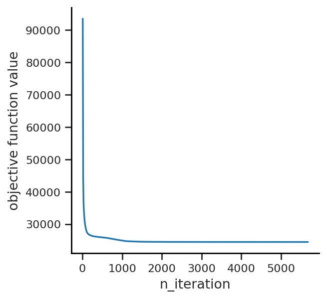

Plot the learned signatures as mutational profiles.

```python
axes = so.pl.barplot(model.asignatures)
```

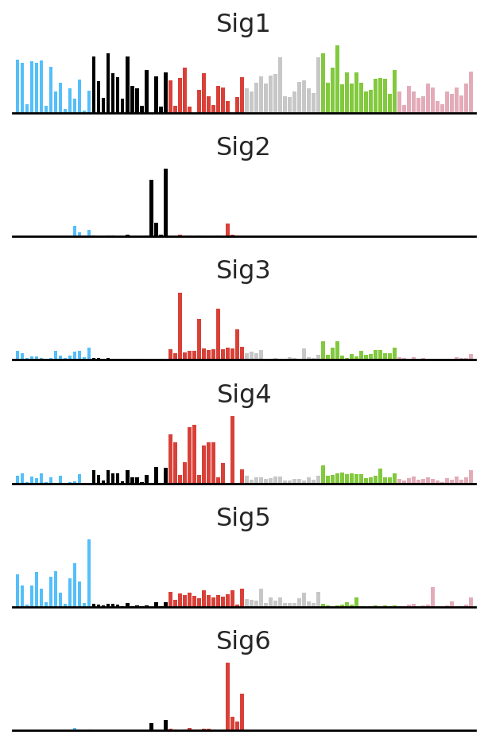

Plot sample exposures as a stacked bar chart.

```python
fig, ax = plt.subplots(figsize=(18, 3))
ax = so.pl.stacked_barplot(
    model.exposures,
    reorder_dimensions=True,
    annotate_obs=False,
    title="KL-NMF signature exposures",
    ax=ax,
)
```

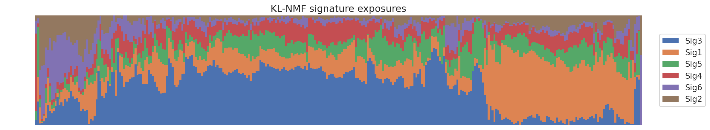

Reduce the dimensionality of the exposures with UMAP and plot the result.

```python
palette = ["#0072b2", "#d55e00"]

so.tl.reduce_dimension(
    model.adata,
    basis="exposures",
    method="umap",
    n_components=2,
    random_state=42,
)
ax = so.pl.embedding(
    model.adata,
    basis="umap",
    hue=adata.obs["hrd_label"],
    palette=palette,
)
```

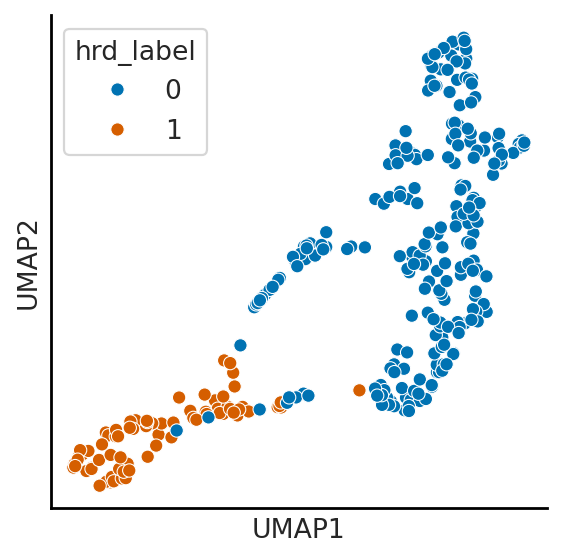

Scatter plots can also be customized by storing colors in the `AnnData` object and passing annotation labels explicitly. By default, Sonata adjusts annotations to reduce overlap.

```python
rng = np.random.default_rng(42)
my_colors = ["cornflowerblue", "silver"]
model.adata.obs["my_color"] = rng.choice(my_colors, adata.n_obs)

special_samples = rng.choice(adata.obs_names, 15, replace=False)
annotations = [
    sample if sample in special_samples else ""
    for sample in adata.obs_names
]

ax = so.pl.embedding(
    model.adata,
    "umap",
    color="my_color",
    annotations=annotations,
    adjust_kwargs={"arrowprops": dict(arrowstyle="-", color="k")},
)
```

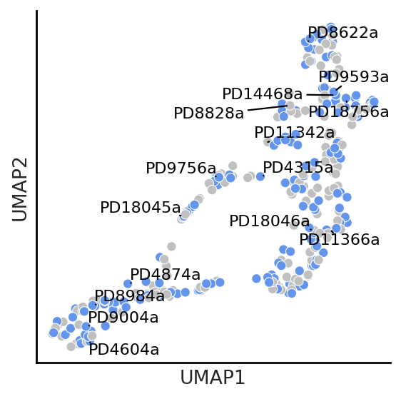

### 3.2 Additional Visualization Functionality

Plot a sample-level annotation against the HRDetect score.

```python
ax = so.pl.scatter(model.adata, x="hrd_label", y="hrdetect_score")
```

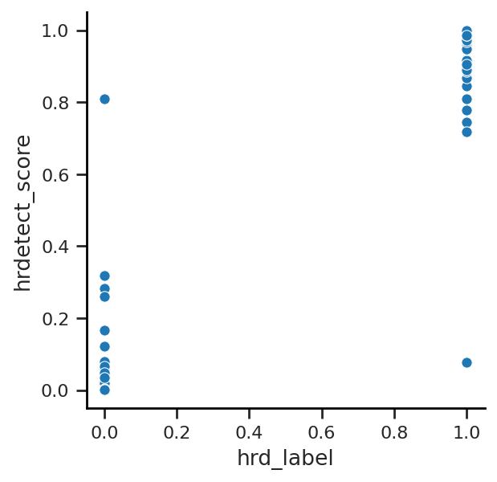

Compute and plot correlations between samples based on their KL-NMF exposures.

```python
so.tl.correlation(model.adata, basis="exposures")
grid = so.pl.correlation(model.adata, figsize=(5, 5))
```

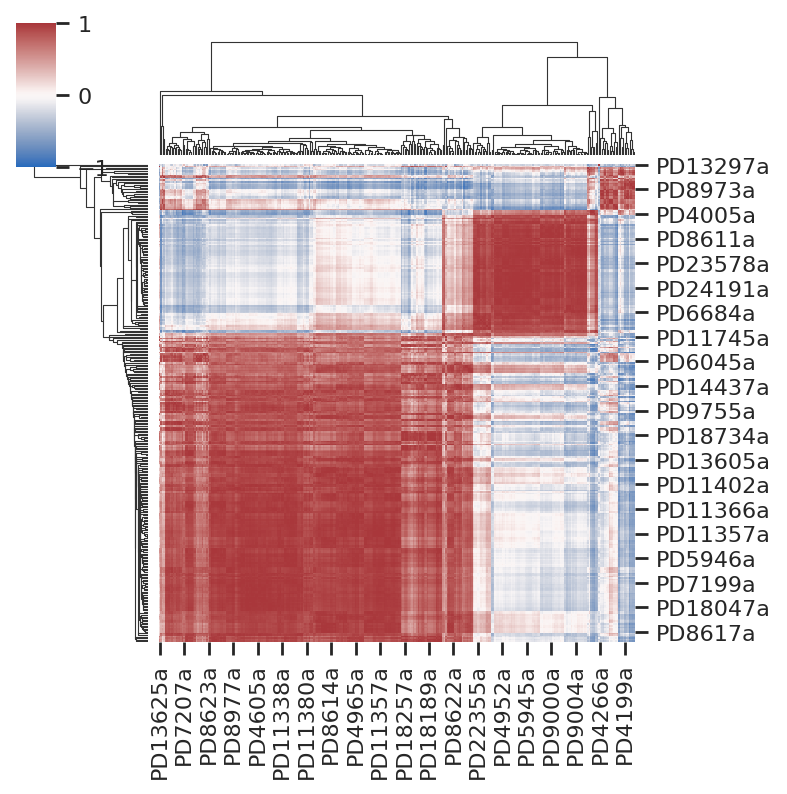

The same correlation plotting function can be used for learned signatures.

```python
model.asignatures.obsp["correlation"] = so.tl.correlation_numpy(model.adata.obsm["exposures"].T)
grid = so.pl.correlation(
    model.asignatures,
    annot=True,
    figsize=(4, 4),
)
```

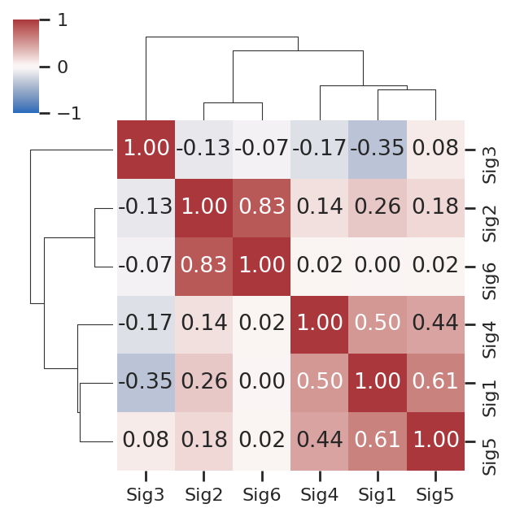

## 4. Fixing Known Signatures

Known signatures can be fixed during fitting by passing them through `given_parameters`.

```python
given_asignatures = ad.AnnData(catalog_sbs.loc[["SBS1", "SBS2"]])

model_fixed = so.models.KLNMF(n_signatures=4)
model_fixed.fit(
    adata.copy(),
    given_parameters={"asignatures": given_asignatures},
    init_kwargs={"seed": 42},
)
model_fixed.signatures.head()
```

Plot the fitted signatures after fixing the known COSMIC signatures.

```python
axes = so.pl.barplot(model_fixed.asignatures)
```

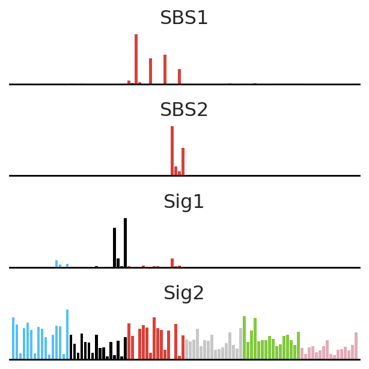

## 5. CorrNMF

CorrNMF models exposures through sample offsets, signature offsets, and joint sample/signature embeddings.

```python
bdata = adata.copy()
bdata.X = adata.X / adata.X.sum(axis=1, keepdims=True) * 960
```

```python
corr_model = so.models.CorrNMF(
    n_signatures=6,
    init_method="random",
    max_iterations=3000
)
corr_model.fit(
    bdata,
    init_kwargs={"seed": 42},
    verbose=True,
)
```

Plot the CorrNMF signatures.

```python
axes = so.pl.barplot(corr_model.asignatures)
```

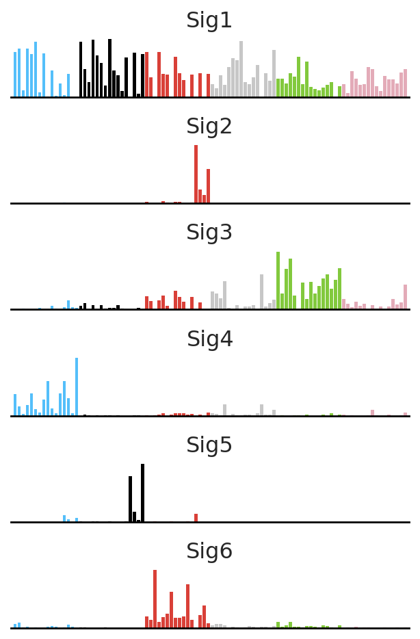

CorrNMF stores signature offsets in `.obs["offsets"]`.

```python
corr_model.asignatures.obs["offsets"]
```

Reduce the dimensionality of sample and signature embeddings jointly with UMAP. Signature points are drawn on top of sample points using explicit z-order annotations, and signature labels are passed to `so.pl.embedding_multiple`.

```python
corr_model.adata.obs["color_embeddings"] = np.where(
    corr_model.adata.obs["hrd_label"].astype(bool),
    "#d55e00",
    "#0072b2",
)
corr_model.adata.obs["zorder_embeddings"] = 1
corr_model.asignatures.obs["color_embeddings"] = "black"
corr_model.asignatures.obs["zorder_embeddings"] = 2

so.tl.reduce_dimension_multiple(
    [corr_model.adata, corr_model.asignatures],
    basis="embeddings",
    method="umap",
    n_components=2,
    random_state=42,
)

fig, ax = plt.subplots(figsize=(4, 4))
ax = so.pl.embedding_multiple(
    [corr_model.asignatures, corr_model.adata],
    basis="umap",
    color="color_embeddings",
    zorder="zorder_embeddings",
    annotations=corr_model.signature_names,
    ax=ax,
)
```

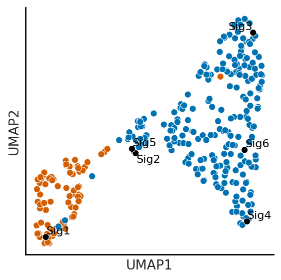

## 6. Choosing a Number of Signatures

This simple sweep is a starting point for model selection. For publication-quality analyses, repeat fits across seeds and compare learned signatures against domain knowledge and known catalogs.

```python
results = []

for n_signatures in range(2, 11):
    candidate = so.models.KLNMF(
        n_signatures=n_signatures,
        init_method="random",
    )
    candidate.fit(adata.copy(), init_kwargs={"seed": 42})
    results.append(
        {
            "n_signatures": n_signatures,
            "reconstruction_error": candidate.reconstruction_error,
        }
    )

results = pd.DataFrame(results)
```

Plot reconstruction error across the candidate values of `n_signatures`.

```python
fig, ax = plt.subplots(1, 1, figsize=(6, 4))

ax.plot(results["n_signatures"], results["reconstruction_error"], marker="o")
ax.set_xlabel("Number of signatures")
ax.set_ylabel("Reconstruction error")
```

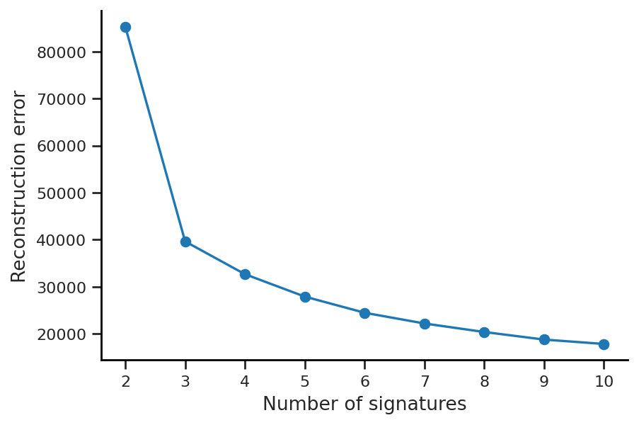
